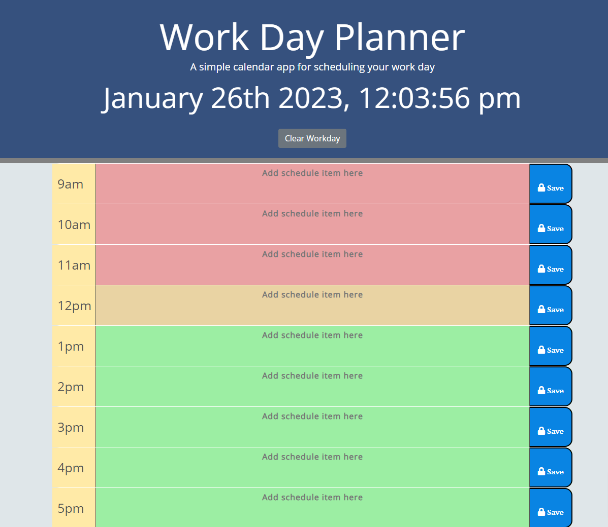

# Workday Planner

The task for this module was ato create a workday planner using DOM manipulation, advanced JavaScript and integration of 3rd party API's.

This app will run in the browser and feature dynamically updated HTML and CSS powered by jQuery.

[moment.js](https://momentjs.com/) is used to manipulate date values for historic data extraction from APIs

[Pixabay](https://pixabay.com/sound-effects/) has been used to source sfx effects

### User Story

    AS AN employee with a busy schedule
    I WANT to add important events to a daily planner
    SO THAT I can manage my time effectively

### Acceptance Criteria

Display the current day at the top of the calendar when a user opens the planner.

Present timeblocks for standard business hours when the user scrolls down.

Color-code each timeblock based on past, present, and future when the timeblock is viewed.

Allow a user to enter an event when they click a timeblock.

Save the event in local storage when the save button is clicked in that timeblock.

Persist events between refreshes of a page.

### URL:
Link to deployed application - https://tomking1983.github.io/workday-planner/

### Screenshot:

